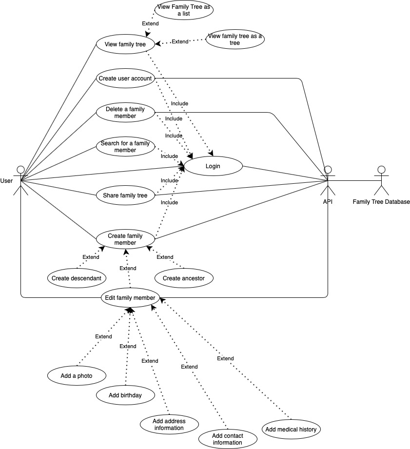
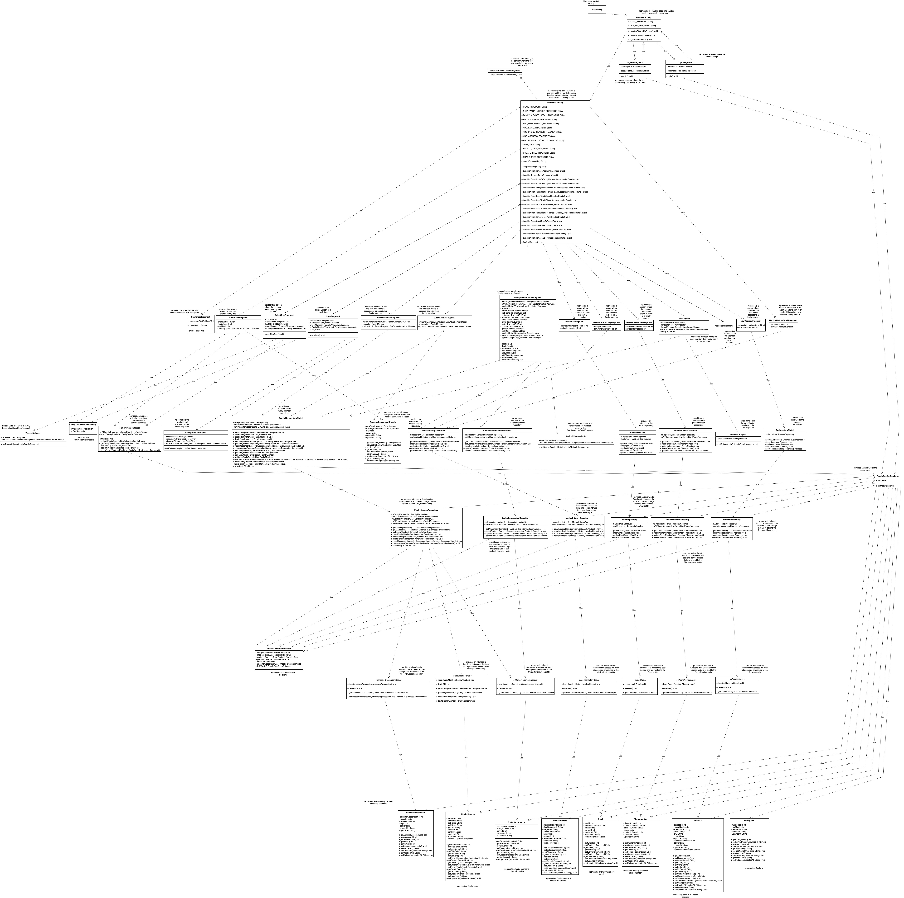
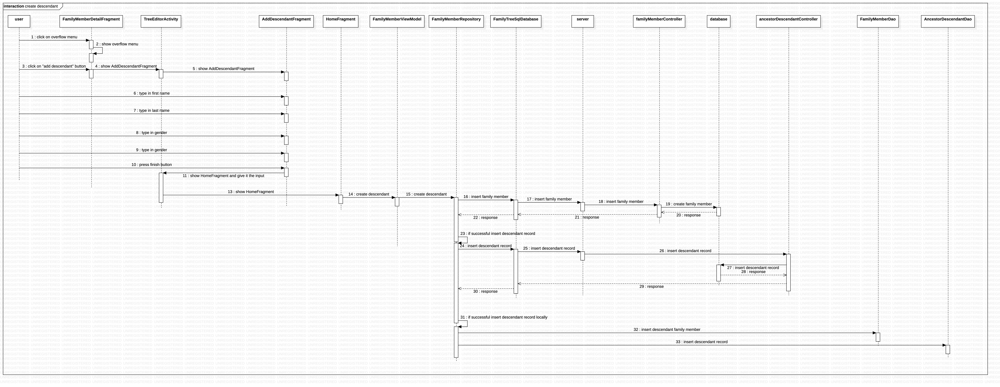

# Family Tree
An Android app for creating, editing, and sharing family trees.
## Features
- Create a family tree
- View your family trees
- Create a user account and login
- Share your family trees with other users
- Add and remove family members, edit family members
- Add direct ancestors and descendants for specific family members
- Add important information to family members like medical history
## Purpose
- To gain experience with Android programming and full stack development (click [here](https://github.com/acomanzo/family_tree_backend) for the backend repository)
- To practice using AGILE
- To practice designing a system
- I gave a [workshop](https://github.com/UAlbany-IEEE-Student-Branch/Fall-2020-Workshop-7-App) on Android development to the UAlbany IEEE Student Chapter and this project is extending the work I completed for that
- My software engineering professor gave us the **option** to individually work on a personal project as part of the course
## User Stories
- Sprint 1 (due Mar 16)
    - ~~as a general user I want to be able to add my family members as a list~~
    - ~~as a general user I want to be able to search for family members~~ 
    - ~~as a general user I want to be able to update family members~~ 
    - ~~as a general user I want to be able to delete family members~~ 
    - ~~as a general user I want to be able to add ancestors and how I'm related to them~~
    - ~~as a general user I want to be able to add descendents and how I'm related to them~~
- Sprint 2 (due Apr 6)
    - create a REST API with CRUD (create, read, update, delete) operations and a database 
    - add functionality in the frontend that queries the REST API so that it can get and store the user's information 
    - ~~as a general user I want to be able to add medical history to family members~~ 
    - as a general user I want to be able to add address information to family members 
    - as a general user I want to be able to add contact information to family members 
    - as a general user I want to be able to see an actual tree representation of my family and I want to be able to interact with the nodes
- Sprint 3 (due Apr 25)
    - as a general user I want to be able to share my family tree with other people 
    - ~~as a general user I want to be able to add birthdates to my family members~~
    - as a general user I want to be able to save a photo for my family members 
    - encrypt all information that gets sent to the database
- Final Wrap Up (due May 11)
    - improve the UI so that it is easy to use, streamlined, simple, and attractive
## Future Goals
- finish imcompleted user stories
- polish the app
    - in particular I would want to make the UI more expressive and more informative
- publish the app on the Google Play Store
## Presentations
If you'd like to watch some of the presentations I gave on the project, you can watch my final presentation [here](https://youtu.be/yu6og2PHEG8) and my final demo [here](https://youtu.be/eiKf_q6p5d0). Thanks for watching! 🥺
## Technologies Used 
- Programming Language: Java
- Libraries: Room, Material Design
- Operating System: Android 4.1 (API 16) and up
## Software Used
- Android Studio
- StarUML
- Draw.io
- iMovie
- Zoom
## Use Case Diagram

## Class Diagram

## Example Sequence Diagram
